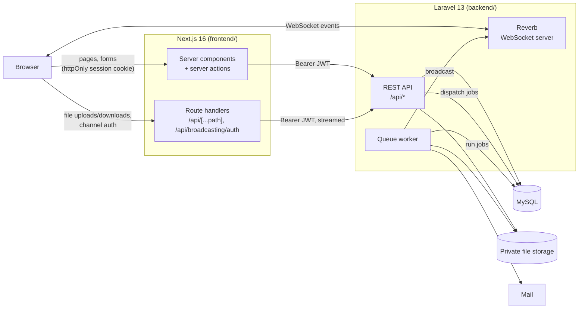

# Architecture Decisions

This document explains how the system is put together and why. Each decision lists what was chosen, why, and what it costs.

## System overview

Two applications in one repository:

- **`backend/`**: a Laravel 13 JSON API. It owns all data, business rules, authorization, files and background work.
- **`frontend/`**: a Next.js 16 App Router app in TypeScript. It renders the UI and holds the user's session.

## 1. Frameworks: Laravel for the API, Next.js for the UI

**Decision.** Laravel 13 (PHP 8.3+) for the backend and Next.js 16 with the App Router for the frontend, as separate apps.

**Why.** The assessment is backend-first. Laravel ships every piece it asks for as first-party, well-tested components: queues and job batches, notifications and mail, broadcasting (Reverb), filesystem abstraction, policies, form request validation, and model pruning. That leaves the time for the actual logic instead of plumbing. Next.js gives server rendering, server actions and route handlers, which the auth design below relies on.

**Cost.** Two runtimes (PHP and Node) to install and deploy.

## 2. Authentication: JWT held by the Next.js server, never by browser JavaScript

**Decision.** The API issues JWTs (`php-open-source-saver/jwt-auth`, HS256, 60-minute lifetime). The browser never sees the token:

1. The login form posts to a Next.js server action, which calls `POST /api/auth/login`.
2. The action stores the token in an **httpOnly, SameSite=Lax cookie** (`Secure` in production) that expires when the token does.
3. Server components and server actions read the cookie and call the API with `Authorization: Bearer …` (`frontend/lib/api.ts`).
4. `frontend/proxy.ts` redirects any page request without the cookie to `/login?from=…`, and back after signing in.
5. Logout calls `POST /api/auth/logout`, which blacklists the token, then deletes the cookie.

**Why.** The assessment requires JWT. Keeping it in an httpOnly cookie means an XSS bug can't read and steal it, which it could from `localStorage`. The API stays a plain stateless bearer-token API that any other client (mobile, Postman) can use.

**Cost.** The browser can't call the API directly, so the few things that must go browser → API go through small Next.js route handlers that attach the token (see decision 5 and 9). There is no refresh-token flow: after 60 minutes the next request gets a 401 and the user is sent to the login page.

## 3. Authorization: Laravel policies, exposed to the UI as flags

**Decision.** All rules live in policies (`backend/app/Policies/`):

| Action                                          | Who                                        |
| ----------------------------------------------- | ------------------------------------------ |
| View tasks, comment                             | Any signed-in user                         |
| Update a task, manage its files                 | Admin, the task's creator, or its assignee |
| Delete a task                                   | Admin or the creator                       |
| Delete a comment                                | Admin or the author                        |
| See an export, bulk operation or chunked upload | Only the user who started it               |

Task responses include a `can: { update, delete }` object computed by the same policies, and the UI shows or hides controls from it. For private resources (exports, bulk operations) a stranger gets **404, not 403**, so ids reveal nothing.

**Why.** One source of truth. The UI never re-implements the task rules, so it can't drift from the API. The only rule mirrored in the frontend is comment deletion (author or admin), because comment payloads also arrive over WebSockets, where there is no request user to compute flags for. The API still enforces it.

## 4. Data flow in the frontend: server components and server actions

**Decision.** Pages are React Server Components that fetch from the API on the server. Mutations are server actions that call the API and then either `redirect()` or `refresh()`. Client components are used only where the browser is needed (forms with pending state, drag and drop, WebSockets, toasts).

**Why.** No client-side data layer or API client to maintain, no token in the browser, and pages arrive fully rendered.

**Filters live in the URL.** The dashboard's search, filters, sort and page are query parameters (`/?search=report&status=pending`). The server component reads them and passes them straight to `GET /api/tasks`. Links can be shared, reload and back/forward work, and live refreshes keep the current view. Invalid values in the URL are dropped rather than sent to the API.

## 5. File uploads

**Decision.**

- **Storage.** A private Laravel disk (`ATTACHMENTS_DISK`, `local` by default). Files are stored under random names in `attachments/{task_id}/`, never in the public web root. The only way to get a file is through an authorized download endpoint.
- **Validation.** Allowed extensions are listed in `config/attachments.php` (images, office documents, text/CSV, MP4/WebM/MOV). Laravel's `mimes` rule checks the type **from the file's content**, so renaming `virus.exe` to `photo.png` is rejected. Maximum 50 MB per request.
- **Chunked upload for files over 50 MB** (up to 2 GB). The client starts an upload session, sends 5 MB chunks (any order, retries allowed, each chunk's exact size is checked), then asks the server to complete it. The server assembles the file, validates its content again, and creates the attachment. A cache lock stops two "complete" requests racing. Unfinished sessions and their chunks are pruned after 24 hours. `GET /uploads/{id}` lists received chunks so an interrupted upload can resume.
- **Upload progress in the browser.** The frontend uses `XMLHttpRequest`, not `fetch`, because only XHR reports upload progress. Files go through a Next.js route handler (`app/api/[...path]/route.ts`) that attaches the token and **streams** the body through without buffering it. It forwards an allowlist of routes only (upload, chunked upload, file and thumbnail download, video stream, export download). The frontend switches to chunked upload above 45 MB, leaving headroom under PHP's 50 MB `post_max_size` for the multipart wrapper.

**Why chunking.** PHP and most proxies cap request bodies. Chunks keep every request small, make failures cheap to retry, and allow resuming.

## 6. File processing: virus scan, then thumbnail or video stream

**Decision.** Every upload is saved with `scan_status = pending` and a queued `ScanAttachmentForViruses` job:

- **Clean**: marked `clean`; images then get a queued `GenerateAttachmentThumbnail` job (Intervention Image with GD, scaled to fit 300×300, WebP), and videos get a queued `ProcessVideoAttachment` job (decision 13).
- **Infected**: the file and any thumbnail are deleted, the row is kept as `infected` so users see what happened, and a warning is logged.

Downloads are refused while a file is `pending` (409) or `infected` (410). The frontend shows "Scanning for viruses…" and polls every 3 seconds until the scan finishes.

**The scanner is simulated** behind a `VirusScanner` interface (`app/Contracts/VirusScanner.php`). The bound implementation, `EicarVirusScanner`, detects the industry-standard [EICAR test signature](https://www.eicar.org/download-anti-malware-testfile/), reading the file in 1 MB blocks (with overlap, so a signature split across blocks is still found) to keep memory flat for large files. Swapping in ClamAV means one new class and one binding in `AppServiceProvider`.

**Why this order.** Thumbnails and video streams are only generated from files already known to be clean, so an image or video parsing bug can't be reached with a malicious file.

## 7. File versioning

**Decision.** Each version is its own `task_attachments` row. Rows that are versions of the same file share a `version_group` UUID and have increasing `version` numbers (unique together). Uploading a new version adds a row. Restoring an old version adds a new row pointing at the same stored file instead of copying it. Lists show the latest version of each group. Deleting an attachment deletes all its versions and their files together.

**Why.** Simple queries, full history, and no copying of large files. Because versions are only ever deleted as a group, a shared file can't be deleted while another version still uses it.

## 8. Background jobs: the database queue

**Decision.** The queue uses Laravel's `database` driver.

| Job                                | Trigger                                    | Notes                                                                                                                                                                                                        |
| ---------------------------------- | ------------------------------------------ | ------------------------------------------------------------------------------------------------------------------------------------------------------------------------------------------------------------ |
| `TaskAssigned` (mail notification) | Task created or reassigned to someone else | Queued **after the transaction commits**, so a rolled-back change never sends mail. 3 tries with backoff.                                                                                                    |
| `UpdateTaskStatuses`               | `POST /api/tasks/bulk-status`              | Up to 1000 tasks, split into jobs of 100 in a **job batch**. `GET /api/tasks/bulk-status/{id}` reports progress. Permission for every task is checked up front, so nothing is half-applied because of a 403. |
| `ScanAttachmentForViruses`         | Every upload                               | See decision 6.                                                                                                                                                                                              |
| `ProcessVideoAttachment`           | A clean video                              | Poster thumbnail and HLS stream. See decision 13.                                                                                                                                                            |
| `GenerateAttachmentThumbnail`      | A clean image                              | See decision 6.                                                                                                                                                                                              |
| `GenerateTaskExport`               | `POST /api/exports`                        | CSV or PDF of the tasks matching the given filters. The dashboard's Export button sends the current filters, polls every 1.5 s until it's `completed`, then downloads it.                                    |
| Broadcast events                   | Task and comment changes                   | See decision 9.                                                                                                                                                                                              |

Exports: CSV rows are streamed from the database in batches of 500 (`lazy()`), so memory stays flat for large exports. Cells starting with `=`, `+`, `-`, `@` are prefixed with `'` so spreadsheet apps don't run them as formulas (CSV injection). PDFs (dompdf) are capped at 2000 rows because rendering slows sharply beyond that; larger exports must use CSV. Exports are deleted after 7 days.

Housekeeping: `model:prune` runs daily through the scheduler, deleting expired chunked uploads and old exports together with their files.

**Why the database driver.** It needs no extra infrastructure (MySQL is already there), survives restarts, and supports job batches. Switching to Redis for higher throughput is a one-line `QUEUE_CONNECTION` change.

The queue's `retry_after` is 900 seconds, above the longest job's timeout (video processing, 840 seconds), so a long-running job is never handed to a second worker while the first is still working on it.

## 9. Real-time updates: Laravel Reverb

**Decision.** Laravel Reverb, a first-party WebSocket server speaking the Pusher protocol. The frontend uses Laravel Echo (`@laravel/echo-react`). Channels are private or presence; Echo authorizes both through `POST /api/broadcasting/auth`, which the browser reaches via a Next.js route handler that adds the JWT.

| Channel              | Who may join                    | Event             | Payload                                                              | What the UI does                                                                         |
| -------------------- | ------------------------------- | ----------------- | -------------------------------------------------------------------- | ---------------------------------------------------------------------------------------- |
| `private-tasks`      | Any signed-in user              | `tasks.changed`   | `{ taskIds: number[], action: "created" \| "updated" \| "deleted" }` | Re-fetches the current page (bursts are coalesced into one refresh after 300 ms).        |
| `private-tasks.{id}` | Anyone who can view task `{id}` | `comment.posted`  | `{ comment: Comment }`                                               | Adds the comment (skipping duplicates by id) and shows a toast if someone else wrote it. |
| `private-tasks.{id}` | Anyone who can view task `{id}` | `comment.deleted` | `{ id: number }`                                                     | Removes the comment.                                                                     |

Presence channels carry each member's `{ id, name }` and nothing else:

| Channel                       | Who may join                    | Events                                             | What the UI does                                                                                           |
| ----------------------------- | ------------------------------- | -------------------------------------------------- | ---------------------------------------------------------------------------------------------------------- |
| `presence-online`             | Any signed-in user              | Member joined / left                               | Header shows who is online (avatars on wider screens, a count on phones).                                  |
| `presence-tasks.{id}.viewers` | Anyone who can view task `{id}` | Member joined / left; client event `client-typing` | Task page shows who else has it open; the comment box shows who is typing.                                 |

**Typing indicators are client events (whispers).** Typing is ephemeral and high-frequency, so it goes browser to browser through Reverb without touching Laravel or the database. Reverb only accepts client events from members of a presence channel (`accept_client_events_from: members`), which is why typing rides on the viewers channel. The sender whispers `{ typing: true }` at most every 2 seconds while the draft is non-empty, and `{ typing: false }` when it posts or clears the draft. Receivers identify the sender by the `user_id` Reverb stamps on every client event from its authenticated connection, never by anything in the payload, so a member can't make it look like someone else is typing. They show only senders who are current members of the channel, with the name from the presence member list, and drop a typist after 5 seconds without a new whisper or when they leave.

All events are dispatched **after the database transaction commits**, so clients never react to a change that was rolled back.

**Why `tasks.changed` carries ids only.** Different users may see different things, such as the `can` flags. Sending ids and letting each client re-fetch through the normal authorized API avoids leaking data over the socket and keeps one code path for rendering. Comments are the exception: their payload is the same for everyone who can view the task, so sending it directly saves a round trip.

**Why Reverb.** First-party, no third-party account or cost, runs as one more `php artisan` process, and uses the same authorization as the API.

## 10. User feedback: toasts

**Decision.** Sonner renders toasts from a single `<Toaster />` in the root layout. Actions that finish on the same page (save, upload, delete a file) toast directly from the client. Actions that redirect (create or delete a task, sign out) set a short-lived `flash` cookie in the server action; a small client component shows it after the navigation and deletes it. Field validation errors stay inline next to their fields.

## 11. Data model choices

- **Status and priority are strings validated by PHP enums**, not MySQL `ENUM` columns. Adding a value is a code change with no migration, and the enums define the logical sort order (low → urgent).
- **Indexes follow the queries the app runs**: `(status, priority)` for filters, `due_date` for sorting, `(user_id, created_at)` for "my exports", `(version_group, version)` unique for versioning, `created_at` on pruned tables.
- **Deleting a user who created tasks is blocked** by a `RESTRICT` foreign key; tasks assigned to a deleted user become unassigned.

See [database-schema.md](database-schema.md) for every table.

## 12. Testing strategy

| Layer                         | Tool                                              | What it covers                                                                                                                                                                                                            |
| ----------------------------- | ------------------------------------------------- | ------------------------------------------------------------------------------------------------------------------------------------------------------------------------------------------------------------------------- |
| Backend                       | Pest (PHPUnit) on a dedicated MySQL test database | Every endpoint (auth, validation, permissions, responses), the permission policies, database rules (cascades, restrict, unique versions), jobs, events, broadcasting channels, the virus scanner, chunked upload assembly |
| Frontend unit and integration | Vitest + React Testing Library + jsdom            | Components, server actions against a mocked API, the upload proxy and upload logic, URL filter parsing                                                                                                                    |
| End to end                    | Playwright against the real running stack         | Login and logout, task CRUD, filtering, drag-and-drop upload, real-time updates and comments across two browser sessions, phone layouts                                                                                   |

Backend tests run on MySQL, the same engine as production, so foreign keys, unique constraints and the raw SQL used for sorting behave exactly as they will live. They fake the queue, mail and broadcasting and run in about 5 seconds. E2E tests exercise the real queue worker and Reverb.

## 13. Video streaming: HLS with adaptive quality

**Decision.** Uploaded videos (MP4, WebM, MOV) are converted into an HLS stream by a queued `ProcessVideoAttachment` job, once the virus scan passes:

1. `ffprobe` reads the resolution, duration and whether there is an audio track.
2. `ffmpeg` grabs a frame one second in (or halfway through a shorter clip) as the poster; it is stored as the attachment's WebP thumbnail like an image's.
3. `ffmpeg` encodes H.264/AAC renditions at 360p, 720p and 1080p, never above the source resolution (`VideoRenditions`), each cut into 4-second segments, plus a master playlist that lists them with their bandwidth. Key frames are forced every 4 seconds so all renditions switch cleanly at segment boundaries.
4. The playlists and segments are stored under `attachments/{task}/streams/{attachment}/`, and `stream_status` becomes `ready`. If processing still fails after its retries, `stream_status` becomes `failed` and the original file stays downloadable.

The player (`video-player.tsx`) uses [hls.js](https://github.com/video-dev/hls.js), loaded only when someone presses Play, so the library isn't in the page's main bundle. hls.js picks the quality automatically from measured bandwidth and switches mid-playback; a Quality menu lets the viewer pin one. Browsers where hls.js can't run, such as older iPhones, play the same master playlist with their built-in HLS support.

Everything is served through `GET /api/attachments/{id}/stream/{path}`, which checks the user can see the task and accepts only the exact playlist and segment file names, so nothing else on the disk is reachable. The Next.js proxy forwards the same narrow pattern. Because the playlists use relative paths, the player finds every playlist and segment through the proxy without the backend knowing its public address.

**Why HLS.** It is the standard format for adaptive streaming, works in every browser (natively in Safari, through hls.js elsewhere), and is plain static files, so it can later move to S3 or a CDN unchanged. Preparing the renditions once at upload time means playback never waits for transcoding.

**Cost.** `ffmpeg` must be installed where the queue worker runs (`FFMPEG_BINARY` and `FFPROBE_BINARY` override the paths). Transcoding takes CPU time in proportion to the video's length and resolution, and the renditions take storage on top of the original.

## Known limitations and next steps

| Area                     | Current state                                                                                    | Next step                                                                          |
| ------------------------ | ------------------------------------------------------------------------------------------------ | ---------------------------------------------------------------------------------- |
| Virus scanning           | EICAR-only simulation                                                                            | Bind a ClamAV implementation of `VirusScanner`                                     |
| File storage             | Local disk                                                                                       | Set `ATTACHMENTS_DISK=s3`; the code only talks to Laravel's filesystem abstraction |
| Sessions                 | No refresh tokens; re-login after 60 minutes                                                     | Add a refresh endpoint and rotate tokens in the Next.js server                     |
| Attachments in real time | Other viewers see new files after a refresh                                                      | Broadcast attachment events on `private-tasks.{id}`                                |
| Comments                 | Can't be edited                                                                                  | Add `updated_at` and an edit endpoint                                              |
| Search                   | Title only                                                                                       | Full-text index over title and description                                         |
| Seeded attachments       | Rows without files; downloading one returns an error                                             | Seed real sample files, and return 404 when a stored file is missing               |
| Video processing         | Runs on the same queue as everything else, so a long transcode delays scans and emails behind it | Move `ProcessVideoAttachment` to a dedicated `media` queue with its own worker     |
| Bonus challenges         | Redis caching is not implemented                                                                 |                                                                                    |
