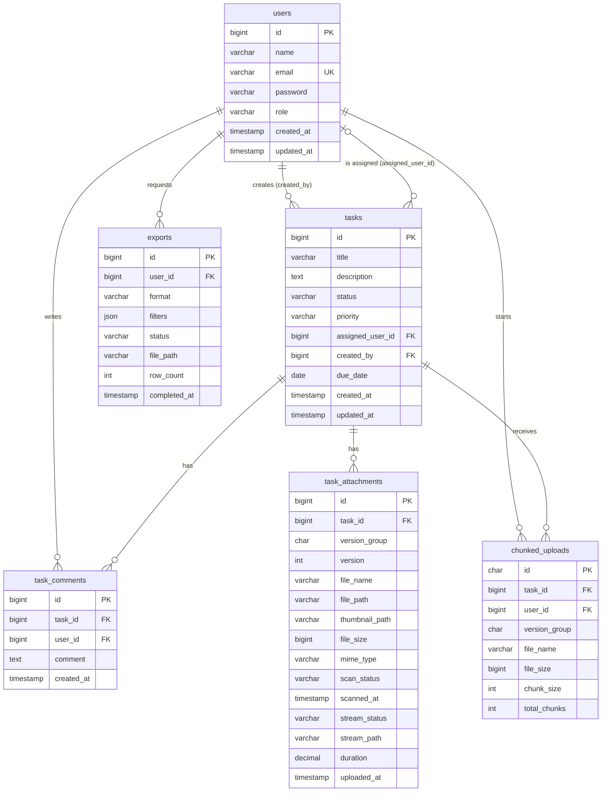

# Database Schema

MySQL 8+ (developed on MySQL 9.2), InnoDB, `utf8mb4_unicode_ci`. The schema is built by the Laravel migrations in `backend/database/migrations/`. Two SQL files are generated from them:

| File                          | Contents                                                                                      |
| ----------------------------- | --------------------------------------------------------------------------------------------- |
| `backend/database/schema.sql` | Every table, index and foreign key. No data.                                                  |
| `backend/database/dump.sql`   | The same schema plus the seeded sample data (7 users, 20 tasks, 35 comments, 10 attachments). |

Load either one into an empty database:

```bash
mysql -u root -p -e "CREATE DATABASE transcosmos CHARACTER SET utf8mb4 COLLATE utf8mb4_unicode_ci"
mysql -u root -p transcosmos < backend/database/dump.sql
```

The dump includes the `migrations` table, so `php artisan migrate` treats the database as up to date afterwards.

## Entity relationships



## Core tables

These are the four entities the assessment asks for. All required columns are present; extra columns are marked _(added)_ with the feature they support.

### `users`

| Column                     | Type            | Null | Default        | Notes                                       |
| -------------------------- | --------------- | ---- | -------------- | ------------------------------------------- |
| `id`                       | bigint unsigned | no   | auto increment | Primary key                                 |
| `name`                     | varchar(255)    | no   |                |                                             |
| `email`                    | varchar(255)    | no   |                | Unique                                      |
| `email_verified_at`        | timestamp       | yes  |                | Laravel default, unused                     |
| `password`                 | varchar(255)    | no   |                | bcrypt hash                                 |
| `role`                     | varchar(255)    | no   | `member`       | `admin` or `member`                         |
| `remember_token`           | varchar(100)    | yes  |                | Laravel default, unused (the API uses JWTs) |
| `created_at`, `updated_at` | timestamp       | yes  |                |                                             |

**Indexes:** unique `email`; `role`.

### `tasks`

| Column                     | Type            | Null | Default        | Notes                                                                 |
| -------------------------- | --------------- | ---- | -------------- | --------------------------------------------------------------------- |
| `id`                       | bigint unsigned | no   | auto increment | Primary key                                                           |
| `title`                    | varchar(255)    | no   |                |                                                                       |
| `description`              | text            | yes  |                |                                                                       |
| `status`                   | varchar(255)    | no   | `pending`      | `pending`, `in_progress`, `completed`, `cancelled`                    |
| `priority`                 | varchar(255)    | no   | `medium`       | `low`, `medium`, `high`, `urgent`                                     |
| `assigned_user_id`         | bigint unsigned | yes  |                | → `users.id`, **set null** when the user is deleted                   |
| `created_by`               | bigint unsigned | no   |                | → `users.id`, **restrict**: a user who created tasks can't be deleted |
| `due_date`                 | date            | yes  |                |                                                                       |
| `created_at`, `updated_at` | timestamp       | yes  |                |                                                                       |

**Indexes:** `(status, priority)` for filtering by status, or by status and priority together; `due_date` for sorting and overdue checks; `assigned_user_id` and `created_by` (foreign key indexes, also used by the assignee and creator filters).

Status and priority are stored as strings rather than MySQL `ENUM`s, so adding a value needs no schema change. The allowed values are enforced by PHP enums (`app/Enums/TaskStatus.php`, `TaskPriority.php`) and request validation. When sorting by status or priority, the API orders by the enums' logical order (low → urgent), not alphabetically.

### `task_attachments`

| Column           | Type            | Null | Default        | Notes                                                          |
| ---------------- | --------------- | ---- | -------------- | -------------------------------------------------------------- |
| `id`             | bigint unsigned | no   | auto increment | Primary key                                                    |
| `task_id`        | bigint unsigned | no   |                | → `tasks.id`, **cascade**                                      |
| `version_group`  | char(36)        | no   |                | _(added, versioning)_ UUID shared by every version of one file |
| `version`        | int unsigned    | no   | `1`            | _(added, versioning)_ 1, 2, 3… within the group                |
| `file_name`      | varchar(255)    | no   |                | Original name as uploaded                                      |
| `file_path`      | varchar(255)    | no   |                | Path on the private attachments disk (random name)             |
| `thumbnail_path` | varchar(255)    | yes  |                | _(added, thumbnails)_ WebP thumbnail: images, and video poster frames |
| `file_size`      | bigint unsigned | no   |                | Bytes (bigint so files over 4 GB would still fit)              |
| `mime_type`      | varchar(255)    | no   |                | Detected from the file content                                 |
| `scan_status`    | varchar(255)    | no   | `pending`      | _(added, virus scan)_ `pending`, `clean`, `infected`           |
| `scanned_at`     | timestamp       | yes  |                | _(added, virus scan)_                                          |
| `stream_status`  | varchar(255)    | yes  |                | _(added, video streaming)_ `pending`, `ready`, `failed`; null for non-videos |
| `stream_path`    | varchar(255)    | yes  |                | _(added, video streaming)_ Directory holding the HLS playlists and segments |
| `duration`       | decimal(10,3)   | yes  |                | _(added, video streaming)_ Video length in seconds             |
| `uploaded_at`    | timestamp       | no   | current time   |                                                                |

**Indexes:** unique `(version_group, version)`, which prevents two uploads from getting the same version number and also serves "all versions of this file" lookups; `task_id`.

Every row is one version. The "current" attachment is the row with the highest `version` in its group. Restoring an old version adds a new row that points at the same stored file. Versions are only ever deleted together, so files are never shared with something that outlives them.

### `task_comments`

| Column       | Type            | Null | Default        | Notes                                                 |
| ------------ | --------------- | ---- | -------------- | ----------------------------------------------------- |
| `id`         | bigint unsigned | no   | auto increment | Primary key                                           |
| `task_id`    | bigint unsigned | no   |                | → `tasks.id`, **cascade**                             |
| `user_id`    | bigint unsigned | no   |                | → `users.id`, **cascade**                             |
| `comment`    | text            | no   |                | Up to 5000 characters (validated by the API)          |
| `created_at` | timestamp       | no   | current time   | Comments can't be edited, so there is no `updated_at` |

**Indexes:** `task_id` (serves "comments for this task"), `user_id`.

## Supporting tables

### `chunked_uploads`

One row per in-progress upload of a file over 50 MB. The chunks themselves are stored on disk under `chunks/{id}/`, not in the database.

| Column                     | Type               | Notes                                                                 |
| -------------------------- | ------------------ | --------------------------------------------------------------------- |
| `id`                       | char(36)           | UUID primary key                                                      |
| `task_id`                  | bigint unsigned    | → `tasks.id`, cascade                                                 |
| `user_id`                  | bigint unsigned    | → `users.id`, cascade. Only this user can send chunks                 |
| `version_group`            | char(36), nullable | Set when the upload is a new version of an existing file              |
| `file_name`                | varchar(255)       |                                                                       |
| `file_size`                | bigint unsigned    | Bytes                                                                 |
| `chunk_size`               | int unsigned       | Bytes (5 MB by default)                                               |
| `total_chunks`             | int unsigned       |                                                                       |
| `created_at`, `updated_at` | timestamp          | `created_at` is indexed: unfinished uploads are pruned after 24 hours |

### `exports`

One row per CSV/PDF export request.

| Column                     | Type                   | Notes                                                              |
| -------------------------- | ---------------------- | ------------------------------------------------------------------ |
| `id`                       | bigint unsigned        | Primary key                                                        |
| `user_id`                  | bigint unsigned        | → `users.id`, cascade                                              |
| `format`                   | varchar(255)           | `csv` or `pdf`                                                     |
| `filters`                  | json                   | The task filters and sort the export was requested with            |
| `status`                   | varchar(255)           | `pending`, `processing`, `completed`, `failed` (default `pending`) |
| `file_path`                | varchar(255), nullable | Set when generated                                                 |
| `row_count`                | int unsigned, nullable |                                                                    |
| `completed_at`             | timestamp, nullable    |                                                                    |
| `created_at`, `updated_at` | timestamp              |                                                                    |

**Indexes:** `(user_id, created_at)` for "my exports, newest first"; `created_at` for pruning exports older than 7 days.

### Laravel framework tables

| Table                                | Used for                                                                                               |
| ------------------------------------ | ------------------------------------------------------------------------------------------------------ |
| `jobs`, `failed_jobs`, `job_batches` | The database queue driver. `job_batches` tracks bulk status updates.                                   |
| `cache`, `cache_locks`               | The database cache driver. A cache lock stops two requests completing the same chunked upload at once. |
| `sessions`, `password_reset_tokens`  | Laravel defaults, unused by the API.                                                                   |
| `migrations`                         | Which migrations have run.                                                                             |

## Deletion behaviour

| When this is deleted… | …this happens                                                                                                                                                                                           |
| --------------------- | ------------------------------------------------------------------------------------------------------------------------------------------------------------------------------------------------------- |
| A task                | Its comments, attachment rows and chunked upload rows are deleted by the database (cascade). The API also deletes the stored files and chunks, which the database can't do.                             |
| A user                | Their comments, chunked uploads and exports are deleted. Tasks assigned to them become unassigned. Deleting a user who **created** tasks is refused (restrict), so task history is never lost silently. |

## Sample data

`php artisan migrate --seed` (or loading `dump.sql`) creates:

| Data        | Count | Notes                                                                                                                                                         |
| ----------- | ----- | ------------------------------------------------------------------------------------------------------------------------------------------------------------- |
| Users       | 7     | `admin@example.com` (admin) plus 6 members. Every password is `password`.                                                                                     |
| Tasks       | 20    | Random statuses, priorities, assignees and due dates                                                                                                          |
| Comments    | 35    | Spread across the tasks and users                                                                                                                             |
| Attachments | 10    | Database rows only. There are no files behind them, so they can't be downloaded. Upload real files through the app to try downloads, thumbnails and scanning. |
