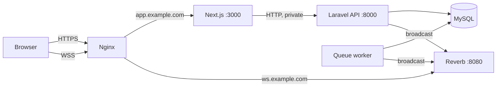

# Deployment Guide

How to run the platform in production on a single Linux server (Ubuntu 24.04 in the examples) with Nginx, Supervisor and MySQL. The same pieces map directly onto managed platforms; see the end of this guide.

## What runs in production

| Process             | Command                                        | Listens on       | Public?                                         |
| ------------------- | ---------------------------------------------- | ---------------- | ----------------------------------------------- |
| Next.js frontend    | `npm run start`                                | `127.0.0.1:3000` | Yes, through Nginx at `https://app.example.com` |
| Laravel API         | PHP-FPM behind Nginx                           | `127.0.0.1:8000` | **No.** Only the Next.js server calls it        |
| Queue worker        | `php artisan queue:work`                       |                  |                                                 |
| Reverb (WebSockets) | `php artisan reverb:start`                     | `127.0.0.1:8080` | Yes, through Nginx at `wss://ws.example.com`    |
| Scheduler           | `php artisan schedule:run` every minute (cron) |                  |                                                 |
| MySQL 8+            |                                                | `127.0.0.1:3306` | No                                              |

The browser only ever talks to the Next.js app and to Reverb. Every API call, including file uploads and downloads, goes through the Next.js server, which attaches the user's token (see [architecture.md](architecture.md), decisions 2 and 5). So the Laravel API can stay on a private address, which removes a whole attack surface.



## 1. Server requirements

- PHP 8.3+ with FPM and the `pdo_mysql`, `gd`, `mbstring`, `fileinfo`, `openssl`, `intl` extensions
- Composer 2, Node.js 20.9+, MySQL 8+, Nginx, Supervisor, Certbot (TLS)
- `ffmpeg` and `ffprobe` (`apt install ffmpeg`) on the server that runs the queue worker, for video streaming
- Two DNS names pointing at the server, for example `app.example.com` and `ws.example.com`

Set PHP's upload limits in **both** the FPM and CLI `php.ini`:

```ini
upload_max_filesize = 50M
post_max_size = 50M
```

## 2. Database

```sql
CREATE DATABASE transcosmos CHARACTER SET utf8mb4 COLLATE utf8mb4_unicode_ci;
CREATE USER 'transcosmos'@'localhost' IDENTIFIED BY 'a-long-random-password';
GRANT ALL PRIVILEGES ON transcosmos.* TO 'transcosmos'@'localhost';
```

## 3. Backend

```bash
cd /var/www/transcosmos/backend
composer install --no-dev --optimize-autoloader
cp .env.example .env
php artisan key:generate
php artisan jwt:secret --force
```

Production `.env` values (everything else can stay at its default):

```ini
APP_ENV=production
APP_DEBUG=false
APP_URL=http://127.0.0.1:8000
FRONTEND_URL=https://app.example.com

DB_DATABASE=transcosmos
DB_USERNAME=transcosmos
DB_PASSWORD=a-long-random-password

QUEUE_CONNECTION=database
BROADCAST_CONNECTION=reverb

# Reverb app credentials: random strings (see setup-guide.md)
REVERB_APP_ID=...
REVERB_APP_KEY=...
REVERB_APP_SECRET=...
# Where Reverb itself listens (behind Nginx)
REVERB_SERVER_HOST=127.0.0.1
REVERB_SERVER_PORT=8080
# Where Laravel sends events to Reverb: the internal address
REVERB_HOST=127.0.0.1
REVERB_PORT=8080
REVERB_SCHEME=http

# Real email delivery for task assignment notifications
MAIL_MAILER=smtp
MAIL_HOST=smtp.your-provider.com
MAIL_PORT=587
MAIL_USERNAME=...
MAIL_PASSWORD=...
MAIL_FROM_ADDRESS=tasks@example.com
```

> **`APP_DEBUG` must be `false`.** With it on, any error returns a full stack trace and file paths to the caller.

Then:

```bash
php artisan migrate --force
php artisan optimize          # caches config, routes, events and views
```

Only run `php artisan db:seed` if you want the demo data. It creates `admin@example.com` with the password `password`.

Make `storage/` and `bootstrap/cache/` writable by the web server user (for example `chown -R www-data:www-data storage bootstrap/cache`).

**Uploaded files** are stored in `backend/storage/app/private`. Keep that directory on persistent storage and include it in backups. To use S3 instead, run `composer require league/flysystem-aws-s3-v3`, fill in the `AWS_*` variables, and set `ATTACHMENTS_DISK=s3` and `EXPORTS_DISK=s3`.

## 4. Frontend

`NEXT_PUBLIC_*` variables are **built into the JavaScript**, so set them before building:

```bash
cd /var/www/transcosmos/frontend
cat > .env.production.local <<'EOF'
API_URL=http://127.0.0.1:8000/api
NEXT_PUBLIC_REVERB_APP_KEY=<same as REVERB_APP_KEY>
NEXT_PUBLIC_REVERB_HOST=ws.example.com
NEXT_PUBLIC_REVERB_PORT=443
NEXT_PUBLIC_REVERB_SCHEME=https
EOF
npm ci
npm run build
```

`API_URL` is only used by the Next.js server, so it points at the private API address. The Reverb values are what the **browser** uses, so they point at the public WebSocket address.

In production the session cookie is marked `Secure`, so the app must be served over HTTPS or sign-in won't stick.

## 5. Nginx

`/etc/nginx/sites-available/transcosmos`:

```nginx
server {
    listen 127.0.0.1:8000;
    root /var/www/transcosmos/backend/public;
    index index.php;
    client_max_body_size 50m;

    location / {
        try_files $uri $uri/ /index.php?$query_string;
    }

    location ~ \.php$ {
        include fastcgi_params;
        fastcgi_param SCRIPT_FILENAME $realpath_root$fastcgi_script_name;
        fastcgi_pass unix:/run/php/php8.4-fpm.sock;
        fastcgi_read_timeout 120s;
    }
}

server {
    server_name app.example.com;
    client_max_body_size 50m;

    location / {
        proxy_pass http://127.0.0.1:3000;
        proxy_http_version 1.1;
        proxy_set_header Host $host;
        proxy_set_header X-Forwarded-For $proxy_add_x_forwarded_for;
        proxy_set_header X-Forwarded-Proto $scheme;
        proxy_request_buffering off;
        proxy_read_timeout 300s;
    }
}

server {
    server_name ws.example.com;

    location / {
        proxy_pass http://127.0.0.1:8080;
        proxy_http_version 1.1;
        proxy_set_header Upgrade $http_upgrade;
        proxy_set_header Connection "Upgrade";
        proxy_set_header Host $host;
        proxy_read_timeout 3600s;
    }
}
```

`proxy_request_buffering off` lets uploads stream straight through to Next.js and on to the API, so upload progress in the browser reflects real progress. Adjust the PHP-FPM socket path to your PHP version.

Enable the site and add TLS for the two public names:

```bash
ln -s /etc/nginx/sites-available/transcosmos /etc/nginx/sites-enabled/
nginx -t && systemctl reload nginx
certbot --nginx -d app.example.com -d ws.example.com
```

## 6. Long-running processes (Supervisor)

`/etc/supervisor/conf.d/transcosmos.conf`:

```ini
[program:transcosmos-queue]
command=php /var/www/transcosmos/backend/artisan queue:work --sleep=1 --max-time=3600
user=www-data
numprocs=2
process_name=%(program_name)s_%(process_num)02d
autostart=true
autorestart=true
stopwaitsecs=900
redirect_stderr=true
stdout_logfile=/var/log/transcosmos/queue.log

[program:transcosmos-reverb]
command=php /var/www/transcosmos/backend/artisan reverb:start
user=www-data
autostart=true
autorestart=true
redirect_stderr=true
stdout_logfile=/var/log/transcosmos/reverb.log

[program:transcosmos-frontend]
command=npm run start -- -p 3000 -H 127.0.0.1
directory=/var/www/transcosmos/frontend
user=www-data
environment=NODE_ENV="production"
autostart=true
autorestart=true
redirect_stderr=true
stdout_logfile=/var/log/transcosmos/frontend.log
```

```bash
mkdir -p /var/log/transcosmos
supervisorctl reread && supervisorctl update
```

The file-processing, export, bulk-update and email jobs set their own retry counts and backoff, so the worker needs no `--tries`; broadcast events are attempted once. `stopwaitsecs=900` lets a running job finish before a restart; the longest, video processing, has an 840-second timeout. Keep the queue's `retry_after` (`DB_QUEUE_RETRY_AFTER`, default 900) above that timeout.

## 7. Scheduler

Old exports (7 days) and abandoned chunked uploads (24 hours) are pruned by a daily scheduled task. Add to the `www-data` crontab (`crontab -u www-data -e`):

```cron
* * * * * cd /var/www/transcosmos/backend && php artisan schedule:run >> /dev/null 2>&1
```

## 8. Checking it works

```bash
curl -s -o /dev/null -w "%{http_code}\n" http://127.0.0.1:8000/up     # 200: API is up
supervisorctl status                                                   # all RUNNING
```

Then sign in at `https://app.example.com`, open a task in two windows and post a comment. It should appear in the other window within a second. If it doesn't, check `/var/log/transcosmos/reverb.log` and the browser console for a failed `wss://ws.example.com` connection.

## 9. Deploying an update

```bash
cd /var/www/transcosmos
git pull

cd backend
composer install --no-dev --optimize-autoloader
php artisan migrate --force
php artisan optimize
php artisan queue:restart        # workers finish their current job, then reload the new code
php artisan reverb:restart

cd ../frontend
npm ci
npm run build
supervisorctl restart transcosmos-frontend
```

## 10. Security checklist

- [ ] `APP_DEBUG=false` and `APP_ENV=production`
- [ ] New `APP_KEY`, `JWT_SECRET` and Reverb credentials, never reused from development
- [ ] The API (`127.0.0.1:8000`) and MySQL are not reachable from the internet
- [ ] HTTPS on both public names (required for the `Secure` session cookie and `wss://`)
- [ ] `storage/app/private` is outside the web root (it is by default) and backed up
- [ ] Demo seed data not loaded, or the `admin@example.com` password changed
- [ ] A real virus scanner bound in place of the EICAR simulation if users upload untrusted files (see [architecture.md](architecture.md), decision 6)

## Managed platforms

The same processes run on any platform that supports PHP and Node:

| Piece                                | Laravel Cloud / Forge                                       | Other platforms                                                                            |
| ------------------------------------ | ----------------------------------------------------------- | ------------------------------------------------------------------------------------------ |
| API, queue worker, scheduler, Reverb | Built-in: add a worker, enable the scheduler, enable Reverb | A PHP container with three extra processes (`queue:work`, `reverb:start`, `schedule:work`) |
| Frontend                             | Any Node host (Vercel, a Node container)                    | Set `API_URL` to the API's address; if the API has to be public, keep it on HTTPS          |
| Files                                | S3-compatible storage (see section 3)                       |                                                                                            |
| Database                             | Managed MySQL 8                                             |                                                                                            |

If the frontend and API run on different hosts, the API must be reachable from the frontend's servers but still doesn't need to accept browser traffic: there is no CORS setup to do, because browsers never call it.
