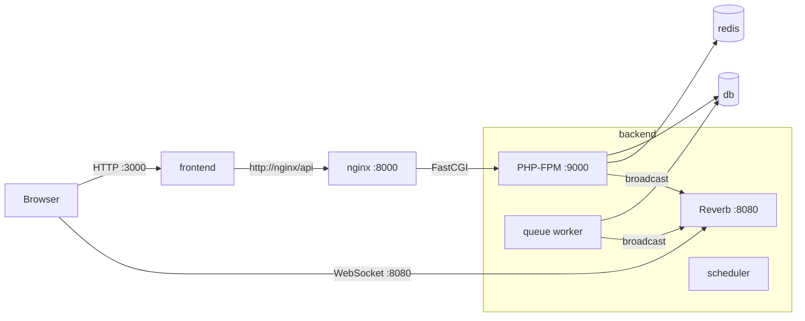

# Deployment Guide

How to run the platform in production with Docker Compose on a single host. Everything, including MySQL and Redis, runs in containers:

| File                  | Purpose                                                                                               |
| --------------------- | ----------------------------------------------------------------------------------------------------- |
| `docker-compose.yml`  | The five services, their volumes and configuration                                                    |
| `.env.example`        | Every setting Compose reads; copy it to `.env`                                                        |
| `backend/Dockerfile`  | PHP 8.4 FPM with the Laravel app, its extensions, ffmpeg and Supervisor                               |
| `backend/docker/`     | `php.ini` overrides, `supervisord.conf`, the startup script, and `nginx.conf` for the `nginx` service |
| `frontend/Dockerfile` | The Next.js app built as a standalone Node server                                                     |

## What runs

| Service    | Image                 | Does                                                                                                       | Published port  |
| ---------- | --------------------- | ---------------------------------------------------------------------------------------------------------- | --------------- |
| `frontend` | `frontend/Dockerfile` | Next.js server. The only thing the browser loads pages from                                                | `APP_PORT` 3000 |
| `nginx`    | `nginx:1.27-alpine`   | Takes HTTP requests for the API and passes them to PHP-FPM in `backend` over FastCGI                       | `API_PORT` 8000 |
| `backend`  | `backend/Dockerfile`  | Supervisor runs four processes: PHP-FPM (the API), the queue worker, the scheduler and Reverb (WebSockets) | `WS_PORT` 8080  |
| `db`       | `mysql:8.4`           | Database                                                                                                   | None            |
| `redis`    | `redis:7-alpine`      | Cache: task and user lists, rate limits, JWT blacklist                                                     | None            |



Pages, uploads and downloads go browser → `frontend` → `nginx` → `backend`, with the Next.js server attaching the user's token (see [architecture.md](architecture.md), decisions 2 and 5). The API port is published too, for tools like Postman and the E2E tests; the browser doesn't need it.

On start, `backend` waits for `db` and `redis` to be healthy, caches its configuration (`php artisan optimize`), applies migrations (`php artisan migrate --force`), then starts its four processes. `frontend` starts once `nginx` answers `/up`.

## 1. Requirements

- Docker Engine 24+ with the Compose plugin (`docker compose version`)
- About 2 GB of RAM, and disk for uploaded files and video renditions
- For a public deployment: two DNS names (for example `app.example.com` and `ws.example.com`) and a reverse proxy with TLS on the host (section 5)

## 2. Configure

```bash
cp .env.example .env
```

Generate the secrets and paste the output into `.env`:

```bash
echo "APP_KEY=base64:$(openssl rand -base64 32)"
echo "JWT_SECRET=$(openssl rand -hex 32)"
echo "DB_PASSWORD=$(openssl rand -hex 16)"
echo "DB_ROOT_PASSWORD=$(openssl rand -hex 16)"
echo "REVERB_APP_ID=$(openssl rand -hex 4)"
echo "REVERB_APP_KEY=$(openssl rand -hex 16)"
echo "REVERB_APP_SECRET=$(openssl rand -hex 16)"
```

Compose refuses to start while any of these is empty.

| Variable                                                           | Default                     | Meaning                                                                                       |
| ------------------------------------------------------------------ | --------------------------- | --------------------------------------------------------------------------------------------- |
| `APP_PORT`, `API_PORT`, `WS_PORT`                                  | `3000`, `8000`, `8080`      | Host ports for the frontend, the API and Reverb. `127.0.0.1:3000` publishes on localhost only |
| `FRONTEND_URL`                                                     | `http://localhost:3000`     | Public URL of the app, used in assignment emails                                              |
| `APP_URL`                                                          | `http://localhost:8000`     | Public URL of the API                                                                         |
| `APP_KEY`, `JWT_SECRET`                                            |                             | Laravel encryption key and JWT signing secret                                                 |
| `DB_DATABASE`, `DB_USERNAME`                                       | `transcosmos`               | Database and user created on the first start                                                  |
| `DB_PASSWORD`, `DB_ROOT_PASSWORD`                                  |                             | MySQL passwords                                                                               |
| `REVERB_APP_ID`, `REVERB_APP_KEY`, `REVERB_APP_SECRET`             |                             | Reverb credentials. The key is also built into the frontend                                   |
| `REVERB_PUBLIC_HOST`, `REVERB_PUBLIC_PORT`, `REVERB_PUBLIC_SCHEME` | `localhost`, `8080`, `http` | Where the **browser** opens its WebSocket. Built into the frontend                            |
| `MAIL_*`                                                           | `MAIL_MAILER=log`           | SMTP settings for assignment emails. With `log`, emails are written to the backend's log      |

`REVERB_APP_KEY` and the `REVERB_PUBLIC_*` values are compiled into the browser JavaScript. After changing them, rebuild the frontend: `docker compose up -d --build frontend`.

## 3. Build and start

```bash
docker compose up -d --build
docker compose ps
```

The first build takes a few minutes. When it's done, `db`, `redis` and `nginx` show `healthy`, and the app is at `http://localhost:3000`.

## 4. Users

The database starts empty and the app has no sign-up, so accounts are created on the command line. Create the first admin:

```bash
docker compose exec backend php artisan user:create
```

It asks for the name, email, role (`admin` or `member`) and a password (at least 8 characters, typed hidden and confirmed), then the user can sign in. Name, email and role can also be passed as options, which is handy for adding team members:

```bash
docker compose exec backend php artisan user:create --name="Ada Lovelace" --email=ada@example.com --role=member
```

The password is always prompted, so it never ends up in shell history.

## 5. HTTPS and public access

Keep the published ports on localhost and put a reverse proxy with TLS in front. In `.env`:

```ini
APP_PORT=127.0.0.1:3000
API_PORT=127.0.0.1:8000
WS_PORT=127.0.0.1:8080
FRONTEND_URL=https://app.example.com
REVERB_PUBLIC_HOST=ws.example.com
REVERB_PUBLIC_PORT=443
REVERB_PUBLIC_SCHEME=https
```

Then `docker compose up -d --build`.

Nginx on the host, `/etc/nginx/sites-available/task-management`:

```nginx
server {
    server_name app.example.com;
    client_max_body_size 50m;

    location / {
        proxy_pass http://127.0.0.1:3000;
        proxy_http_version 1.1;
        proxy_set_header Host $host;
        proxy_set_header X-Forwarded-For $proxy_add_x_forwarded_for;
        proxy_set_header X-Forwarded-Proto $scheme;
        proxy_request_buffering off;
        proxy_read_timeout 300s;
    }
}

server {
    server_name ws.example.com;

    location / {
        proxy_pass http://127.0.0.1:8080;
        proxy_http_version 1.1;
        proxy_set_header Upgrade $http_upgrade;
        proxy_set_header Connection "Upgrade";
        proxy_set_header Host $host;
        proxy_read_timeout 3600s;
    }
}
```

```bash
ln -s /etc/nginx/sites-available/task-management /etc/nginx/sites-enabled/
nginx -t && systemctl reload nginx
certbot --nginx -d app.example.com -d ws.example.com
```

`proxy_request_buffering off` lets uploads stream straight through, so the browser's progress bar shows real progress. The API needs no public name; leave `API_PORT` on localhost, or add a third server block for it if other clients need the API.

The frontend runs with `NODE_ENV=production`, which marks the session cookie `Secure`. Browsers accept that on `http://localhost`; anywhere else the app must be on HTTPS or sign-in won't stick.

## 6. Data and backups

| Volume       | Holds                                                              | Back up? |
| ------------ | ------------------------------------------------------------------ | -------- |
| `db-data`    | The database                                                       | Yes      |
| `storage`    | Uploaded files, thumbnails, video streams and exports (`storage/`) | Yes      |
| `redis-data` | Cache only; it rebuilds itself                                     | No       |

```bash
docker compose exec -T db sh -c 'mysqldump -uroot -p"$MYSQL_ROOT_PASSWORD" --single-transaction "$MYSQL_DATABASE"' > backup.sql
docker run --rm -v task-management_storage:/data -v "$PWD":/backup alpine tar czf /backup/storage.tgz -C /data .
```

To keep files on S3 instead of the `storage` volume, add `league/flysystem-aws-s3-v3` to the backend, pass the `AWS_*` variables to `backend`, and set `ATTACHMENTS_DISK=s3` and `EXPORTS_DISK=s3`.

## 7. Deploying an update

```bash
git pull
docker compose up -d --build
```

Compose rebuilds the images and replaces the containers whose image changed; `backend` runs any new migrations as it starts. `backend` has `stop_grace_period: 900s`, so a running job (the longest, video processing, has an 840-second timeout) can finish before the container stops. Keep the queue's `retry_after` (`DB_QUEUE_RETRY_AFTER`, default 900) above that timeout.

## 8. Operating it

```bash
docker compose logs -f backend                 # API, worker, scheduler and Reverb output
docker compose exec backend php artisan about  # run any artisan command
curl http://localhost:8000/up                  # 200 when the API is up
```

**Checking it works.** Sign in, open a task in two windows and post a comment. It should appear in the other window within a second. If it doesn't, look for a failed WebSocket connection to `REVERB_PUBLIC_HOST:REVERB_PUBLIC_PORT` in the browser console.

| Symptom                                    | Fix                                                                                                                                                |
| ------------------------------------------ | -------------------------------------------------------------------------------------------------------------------------------------------------- |
| `required variable ... is missing a value` | Fill in that variable in `.env` (section 2)                                                                                                        |
| `frontend` never starts                    | `nginx` isn't healthy yet. `docker compose logs backend` shows whether migrations failed, usually because of wrong database credentials            |
| Sign-in succeeds but you're sent back      | The site isn't on HTTPS or `localhost`, so the browser drops the `Secure` session cookie (section 5)                                               |
| Nothing updates live                       | The browser can't reach Reverb, or the frontend was built with other Reverb values. Check `REVERB_PUBLIC_*` and `WS_PORT`, then rebuild `frontend` |
| Database password change has no effect     | MySQL only applies `DB_*` on the first start of an empty `db-data` volume. Change it inside MySQL, or remove the volume to start over              |

## 9. Security checklist

- [ ] New `APP_KEY`, `JWT_SECRET`, database and Reverb secrets, never reused from development
- [ ] `.env` is not committed (the root `.gitignore` excludes it)
- [ ] `APP_PORT`, `API_PORT` and `WS_PORT` bound to `127.0.0.1` behind an HTTPS proxy; `db` and `redis` stay unpublished
- [ ] HTTPS on both public names (required for the `Secure` session cookie and `wss://`)
- [ ] The `db-data` and `storage` volumes are backed up
- [ ] A real virus scanner bound in place of the EICAR simulation if users upload untrusted files (see [architecture.md](architecture.md), decision 6)
